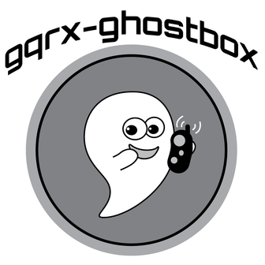

## Overview

This program makes it possible to use software defined radio (SDR) as a ghost box.  A ghost box, or sometimes spirit box, is a device used by paranormal researchers to talk to spirits, the dead, disembodied entities, shape shifting lizard people, and other intra-dimensional fauna.

Some ghost boxes have electronics that give them distinct properties, and others are effectively radio scanners.  This tool is of the radio scanning style.

This utility controls the [Gqrx](http://gqrx.dk/) SDR receiver program.  Unlike more traditional ghost boxes, which are stand alone devices, this setup makes it easy to experiment with different options.  Gqrx provides a live visualization of the spectrum and the ability to fine tune and control many parameters of the radio, such as gain, demodulation, squelch, and noise filtering.  Ghost boxes usually scan AM or FM.  By using SDR, we have a vastly larger spectrum available (though AM may require an upconverter, depending on which SDR is used.)

If we assume that the phenomena is a real thing, this style tool provides researchers with more options and controls than traditional ghost boxes at a lower cost.  A cheap USB RTLSDR is enough to get started, and it is easy to experiment with different antenna configurations as well as radio and scanning parameters to figure out what is most effective.

If this tool works for you, please share any succesful results [here](https://github.com/DougHaber/gqrx-ghostbox/issues/1).


## Installation and Dependencies

In order to use this program you must have a software defined radio device. A $10 RTLSDR could work, as could more expensive and capable options.  For people starting out, I recommend picking an R820T2 based USB stick.  Many well reviewed options can be found on Amazon for between $10 and $25 dollars. (Note that these will not support tuning the AM spectrum without an upconverter.)

Traditional ghost boxes usually scan the AM radio spectrum.  With this tool you can scan any range of the spectrum that your SDR supports.  Unfortunately, the cheaper SDR devices, such as what was recommended above will not receive AM.  To receive AM you will either need a more capable SDR device or another device known as an upconverter.

This program is written in Perl.  The only dependency beyond a recent version of Perl is the [GQRX::Remote](https://github.com/DougHaber/gqrx-remote) module.  This may be installed via the package on GitHub, or from [CPAN](https://metacpan.org/pod/GQRX::Remote).  Here are some [notes on installing CPAN modules](http://www.cpan.org/modules/INSTALL.html).

[Gqrx](http://gqrx.dk/) is required, and must be setup to allow remote connections from the host this program is running on.  For some notes on settings that up, see the [GQRX::Remote README](https://github.com/DougHaber/gqrx-remote#setting-up-gqrx) and [Gqrx's documentation](http://gqrx.dk/doc/remote-control).  The Gqrx application itself officially runs on Linux, MacOS and Raspberry Pi. An unoffical version exists for Windows. For more information, see the [Gqrx download page](http://gqrx.dk/download).

**NOTE**: SDR and Gqrx are not always trivial to work with and this is a command-line tool.  A final dependency would be some level of comfort working with these types of things and a willingness to tinker.  If you have not used SDR, Gqrx, and the command line before, do not expect it to work without some effort.


## Usage

To use this program:

1. Begin by running Gqrx.

2. You must enable remote control via `Tools->Remote control`.  Gqrx has to be setup to allow connections from the host this program is running on (localhost, or otherwise.)  The configuration options are found under `Tools->Remote control settings`.

3. In a terminal, run the `gqrx-ghostbox` command with any desired options.

4. Modify any parameters in Gqrx as needed, such as the gain, squelch, and filtering.

5. Enter a deep trance state and begin your communion with the spirits.


Many examples of ghost box usage can be found on youtube. Generally, it involves asking questions and then listening for a response.  Some people believe a medium or trance state is necessary in order for it to work.  If you search for "ghost box" or "spirit box", you will find information on different usage styles.


### Command Line Options

```
Usage: gqrx-ghostbox [OPTIONS]
  GENERAL:
    -h, --help                          Display this detailed help message
    -q, --quiet                         Quiet mode - only output errors

  CONNECTION:
    -H, --host={IP_ADDRESS}             GQRX Host IP (default is 127.0.0.1)
    -P, --port={PORT}                   GQRX Port (default is 7356)
    -h, --help                          Show this help message

  RADIO SETTINGS:
    -d, --demodulator-mode={MODE}       The GQRX demodulator mode to use
                                        (default is 'WFM')
                                        Options: AM, CW, CWL, CWU, FM, LSB, USB,
                                	    WFM, WFM_ST, WFM_ST_OIRT

  SCANNING SETTINGS:
    --min, --min-frequency={FREQUENCY}  Minimum frequency to scan in KHz
                                        (default is '88000', FM min)
    --max, --max-frequency={FREQUENCY}  Maximum frequency to scan in KHz
                                        (default is '108000', FM max)
    -m, --scanning-mode={MODE}          Method of scanning
                                        (default is 'bounce')
                                        Options: forward, backward, bounce, random
    -s, --scanning-step={STEP_SIZE}     How many KHz to move when scanning
                                        (default is 150)
                                        This has no effect in "random" mode
    --S, --sleep={TIME}			        Time to hold a frequency for each step
	                                    in ms. (default is '30')
```


### Usage Examples

```bash
# Run gqrx-ghostbox with the default parameters
$ gqrx-ghostbox

# Run against Gqrx on a remote server
$ gqrx-ghostbox --host=10.0.0.1 --port 1234

# Perform random scanning between 800mhz and 900mhz
$ gqrx-ghostbox --min=800000 --max=900000 --scanning-mode=random
```


### Usage Notes

The speed of the scan is controlled by two options.  The `--sleep` option determines how long in milliseconds the program waits after changing frequency.  There is no timing loop.  Instead, after an update cycles completes, the sleep is performed for the defined duration.  The `--scanning-step` option tells how far the frequency is adjusted in KHz.   Normal values would range between 50 and 500.

Scanning starts at a random point within the `--min` and `--max` frequency.  When in bounce mode, the starting direction is also random.

The `--scanning-mode` supports 4 different options:

| Mode    | Description |
|---------|-------------|
| forward | Each step increase the current frequency by the `--scanning-step` size.  When exceeding `--max`, start back at `--min`. |
| reverse | Each step decrease the current frequency by the `--scanning-step` size.  When exceeding `--min`, start back at `--max`. |
| bounce  | Start randomly in either `forward` or `backward` mode. When exceeding the `--min` or `--max` limit, switch to the opposite mode. (This is the default) |
| random  | Each step choose a new random frequency within the `--min` and `--max` range. |


## Sharing Results

If you do use this tool and have good results, please share them to help others.  A [GitHub issue](https://github.com/DougHaber/gqrx-ghostbox/issues/1) has been created to share these details.   Please include:

* A description of your usage, what happened, and external links to any media

* The command line options used to invoke gqrx-ghostbox

* The type of hardware used (type of SDR, type of antenna, upconverter)

* Any notable configuration options in Gqrx

* Any other notes on your setup and usage (antenna placements, ancient
  ghost evocation ritual, etc)


## Copyright and License

```
Copyright (c) 2016, Douglas Haber
All rights reserved

Redistribution and use in source and binary forms, with or without
modification, are permitted provided that the following conditions
are met:
    * Redistributions of source code must retain the above copyright
      notice, this list of conditions and the following disclaimer.
    * Redistributions in binary form must reproduce the above
      copyright notice, this list of conditions and the following
      disclaimer in the documentation and/or other materials provided
      with the distribution.
    * The names names of the authors may not be used to endorse or
      promote products derived from this software without specific
      prior written permission.

THIS SOFTWARE IS PROVIDED BY THE COPYRIGHT HOLDER AND ITS
CONTRIBUTERS ''AS IS'' AND ANY EXPRESS OR IMPLIED WARRANTIES,
INCLUDING, BUT NOT LIMITED TO, THE IMPLIED WARRANTIES OF
MERCHANTABILITY AND FITNESS FOR A PARTICULAR PURPOSE ARE
DISCLAIMED. IN NO EVENT SHALL THE COPYRIGHT HOLDER OR ITS
CONTRIBUTERS BE LIABLE FOR ANY DIRECT, INDIRECT, INCIDENTAL,
SPECIAL, EXEMPLARY, OR CONSEQUENTIAL DAMAGES (INCLUDING, BUT NOT
LIMITED TO, PROCUREMENT OF SUBSTITUTE GOODS OR SERVICES; LOSS OF
USE, DATA, OR PROFITS; OR BUSINESS INTERRUPTION) HOWEVER CAUSED AND
ON ANY THEORY OF LIABILITY, WHETHER IN CONTRACT, STRICT LIABILITY,
OR TORT (INCLUDING NEGLIGENCE OR OTHERWISE) ARISING IN ANY WAY OUT
OF THE USE OF THIS SOFTWARE, EVEN IF ADVISED OF THE POSSIBILITY OF
SUCH DAMAGE.
```


